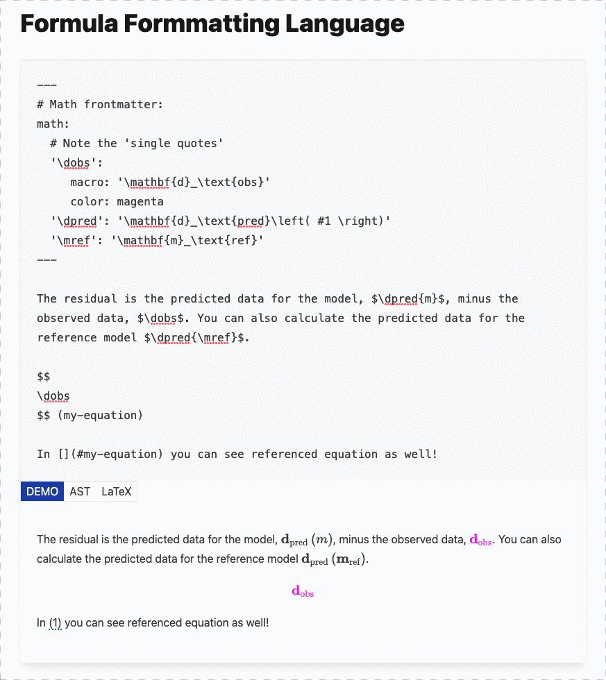

# Formula Formmatting Language

This is a simple demo that allows you to create a MyST plugin for formula formatting.



## Install

To install, this uses a git submodule for the theme.

```sh
git clone --recursive git@github.com:curvenote/ffl-demo
```

## Development

```sh
npm install
npm run dev
```

Note, it may appear to fail on the first time as it builds the css, the second time you run `npm run dev` it should work!
